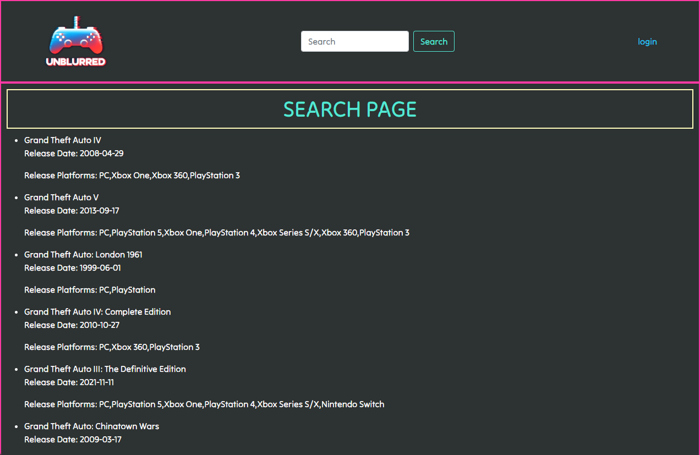
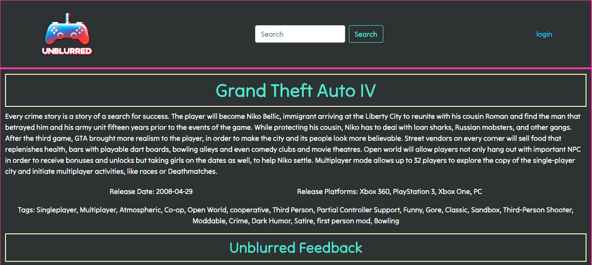

# Unblurrd - Video Game Review network

## Description

Unblurrd is a website that you can use to review some of your favorite games, and also see how others rated games. Our motivation for this project was to try and create something that each of us would potentially use in real life. The tech stack includes HTML, CSS, JS, MySQL, and Handlebars, as well as node packages such as Express and Sequelize. This project was a great way for us to practice and improve our skills in frontend development, backend development, and database manipulation.

## Usage

To access/use this project, simply navigate to ***INSERT HEROKU LINK HERE***. You will be brought to the homepage, where you have the options of logging in/signing up or searching for a game right away. You can search for a game by entering a query into the search bar at the top of the page. After entering your search term, you will be brought to a 'search results' page, where you can select any of the games from the results that best fits what you're looking for. Once a game has been selected, you will then be brought to that game's page. This page will have various details about the game (such as title, description, release date, and platforms), along with a form that logged in users can use to review the game. As more and more users review a game, graphics will fill out displaying contextual data about the game's reviews.

Below are various screenshots of the project in action.

  

## Credits

This project was heavily inspired by websites such as [Letterboxd](https://www.letterboxd.com), [RAWG.io](https://www.rawg.io), [ggapp.io](https://ggapp.io/), and [Backloggd](https://backloggd.com). This project uses the [RAWG.io game database API](https://rawg.io/apidocs).

Contributors to this project include:
 * Kurt Wensmann [github](https://github.com/napoleondd86)
 * Victor Montelongo [github](https://github.com/VictorMontelongo)
 * Ben Pavlis [github](https://github.com/bpavlis)
 * Tim Poffenberger [github](https://github.com/timpyjoe)

